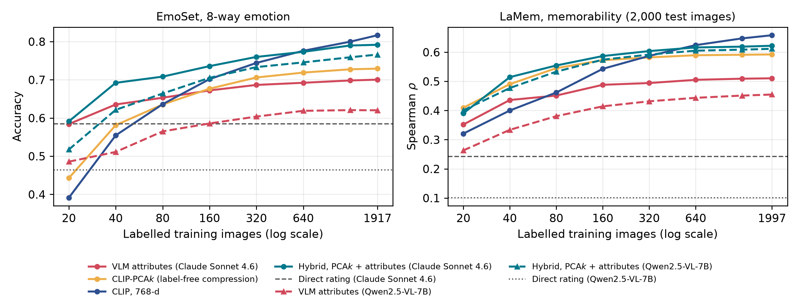

# Complement, Don't Replace

Code and data release for:

> Hamit Soyel. **Complement, Don't Replace: Vision-Language Model Attributes Add What a Frozen
> Encoder Misses When Labels Are Scarce.** Under review.

## The result in one paragraph

Vision-language models (VLMs) are increasingly asked to rate subjective image properties. We test
how a VLM's output should be used to predict human **emotion** (EmoSet, 8 classes) and image
**memorability** (LaMem) when only 20 to about 2,000 labelled images exist, for a proprietary VLM
(**Claude Sonnet 4.6**) and an open-weights VLM (**Qwen2.5-VL-7B-Instruct**). Two controls separate
what the VLM perceives from what dimensionality alone explains: a **dimension-matched** CLIP
compression (PCA fitted on unlabelled images, as many dimensions as the VLM's attribute vector) and
an **equal-size** CLIP code. **VLM attributes are not a substitute** for a frozen encoder: the
label-free compression matches or beats them almost everywhere. **They can be a complement**: at
equal code size, Claude's attributes improve emotion accuracy at every budget up to 1,280 labels
(+16.3 points at 20 labels) and memorability at 40 and 80 labels; Qwen's improve emotion up to 160
labels and memorability at no budget. Repeating the study with **SigLIP** and **DINOv2** shows why:
the attributes add most where the encoder already encodes least of them, so they add far more to a
vision-only encoder (DINOv2) than to an image-text one (CLIP, SigLIP). **Direct rating** is the
weakest use of either model (memorability Spearman ρ = 0.243 for Claude, 0.101 for Qwen). Every
comparison carries a two-level paired bootstrap 95% interval.



## Quick reproduction (CPU, $0, no API key)

Every VLM output, CLIP embedding, and image list used in the paper is included. To regenerate every
number, table, and the figure:

```bash
pip install -r requirements.txt
python analysis.py claude          # results/final_results_claude.json  (Tables 1 to 3, Sections 5.1 to 5.4)
python analysis.py qwen            # results/final_results_qwen.json
python robustness.py claude        # results/robustness_final_claude.json (Section 5.5)
python robustness.py qwen          # results/robustness_final_qwen.json
python make_figures_tables.py      # tables/tab_*.tex and figures/fig_curves.png
```

`analysis.py` is the single source of every number in the main results: one protocol for every
route, budget, task, and VLM. It takes roughly 5 to 10 minutes per VLM on a laptop CPU, and its
output is identical to the files in `results/`.

Additional analyses (Sections 5.4 to 5.6):

```bash
python schema_distill.py           # random half-schema complement test + attribute recoverability from CLIP
python extract_alt_encoders.py     # DINOv2-L and SigLIP-L embeddings (needs the raw images; ~30 min each)
python encoder_robustness.py dinov2l claude   # and: dinov2l qwen, siglipl claude, siglipl qwen
python encoder_distill.py          # attribute recoverability per encoder
python make_encoder_table.py       # tables/tab_encoders.tex
```

The DINOv2 and SigLIP embeddings are not included (about 140 MB per encoder); their results are in
`results/encoder_robustness_*.json` and `results/encoder_distill_results.json`.

## Full reproduction (from raw images)

1. Download the raw images yourself (not redistributed here; see the license section):
   [EmoSet](https://vcc.tech/EmoSet) and [LaMem](http://memorability.csail.mit.edu/).
2. Set the `EDIT ME` paths at the top of `make_splits.py`, `extract_features.py`,
   `label_with_vlm.py`, and `label_with_qwen.py`.
3. Check the image lists (optional; `samples/` is included):
   `python make_splits.py`
4. Extract CLIP embeddings: `python extract_features.py`
5. Label with Claude (Anthropic Batch API; needs `ANTHROPIC_API_KEY`, roughly $40):
   ```bash
   python label_with_vlm.py submit all
   python label_with_vlm.py fetch all
   ```
6. Label with Qwen2.5-VL-7B (free; downloads about 15 GB of weights; several hours on a single
   GPU or Apple-silicon Mac): `python label_with_qwen.py all`
7. Run the Quick reproduction steps above.

## Routes and controls

| Route | Inputs | Uses labels | Uses the VLM |
|---|---|---|---|
| Direct rating | none (zero-shot answer) | no | yes |
| VLM attributes | k attributes (k = 10 EmoSet, 8 LaMem) | yes | yes |
| CLIP | 768-d frozen CLIP ViT-L/14 embedding | yes | no |
| CLIP-PCA*k* (dimension-matched) | first k principal components | yes | no |
| CLIP-PCA*2k* (equal-size control) | first 2k principal components | yes | no |
| Hybrid | CLIP-PCA*k* + the k VLM attributes | yes | yes |

*Substitute test*: VLM attributes vs CLIP-PCA*k*. *Complement test*: Hybrid vs CLIP-PCA*2k*.

## Data and protocol

| | Training pool | Test set | CLIP-only pool |
|---|---|---|---|
| EmoSet | 2,000 images from the training split (1,917 used) | 1,600 from the validation split (1,522 used) | 20,000 training-split images |
| LaMem | 2,000 from `train_1` (1,997 used) | 2,000 from `test_1` | 6,000 from `train_1` |

- Images for which either VLM returned an incomplete attribute record are excluded so that both VLMs
  are compared on identical images (155 images; all but one because Claude omitted the
  aesthetic-quality field). Near-duplicates (CLIP cosine > 0.95) across training, test, and CLIP-only
  pools are removed.
- PCA projections are fitted on the CLIP-only pool, whose labels are never used for that purpose.
  The same pool's labels are used only for the large-budget CLIP reference.
- Budgets n ∈ {20, 40, 80, 160, 320, 640, 1280} plus the full pool; 8 random training subsets per
  budget (class-stratified for EmoSet). Logistic regression (EmoSet) or ridge regression (LaMem) on
  standardized inputs, with the regularizer re-selected by inner cross-validation on every subset.
- Intervals: two-level paired bootstrap, 1,000 resamples of both the training subsets and the test
  images.
- The two VLMs receive identical prompts (`prompts.py`). Claude answers by forced tool call; Qwen
  answers in JSON validated against the same schema, with greedy decoding.

## Repository layout

```
├── analysis.py              all main results (single source of truth)
├── robustness.py            non-linear head, fixed regularizer, drop-one attribute ablation
├── schema_distill.py        half-schema complement test, attribute recoverability from CLIP
├── extract_alt_encoders.py  DINOv2-L and SigLIP-L embeddings -> features/*_dinov2l.npz, *_siglipl.npz
├── encoder_robustness.py    main analysis with another encoder in place of CLIP
├── encoder_distill.py       attribute recoverability for each encoder
├── make_encoder_table.py    tables/tab_encoders.tex
├── make_figures_tables.py   tables/ and figures/ from results/
├── make_splits.py           recreates samples/ from the raw benchmarks
├── extract_features.py      CLIP ViT-L/14 embeddings -> features/
├── label_with_vlm.py        Claude Sonnet 4.6 via the Anthropic Batch API -> labels/
├── label_with_qwen.py       Qwen2.5-VL-7B-Instruct, local -> labels/qwen_*
├── prompts.py               prompts and attribute schemas shared by both VLMs
├── samples/                 image lists for every training and test set
├── labels/                  outputs of both VLMs (Claude: <job>_labels.csv, Qwen: qwen_<job>_labels.csv)
├── features/                CLIP embeddings and the CLIP-only pools
├── results/                 final_results_<vlm>.json, robustness_final_<vlm>.json, encoder and schema results
├── tables/                  LaTeX tables generated for the paper
└── figures/                 fig_curves.png
```

## License and data

- Code: MIT License (see `LICENSE`).
- **Raw EmoSet and LaMem images are not redistributed.** The repository contains only image file
  names, VLM outputs, and derived CLIP embeddings. Obtain the images from each benchmark's release
  page and check its terms before use.
- Claude labels were generated with Claude Sonnet 4.6 via the Anthropic API; Qwen labels with
  Qwen2.5-VL-7B-Instruct (Apache-2.0 weights).
